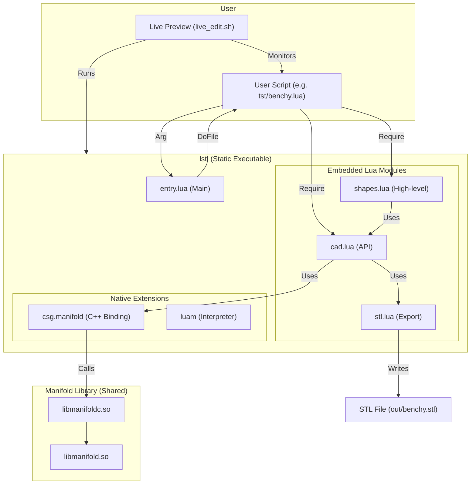

# LSTL Architecture

```mermaid
graph TD
    subgraph User
        Script["User Script (e.g. tst/benchy.lua)"]
        Live["Live Preview (live_edit.sh)"]
    end

    subgraph LSTL_Binary ["lstl (Static Executable)"]
        Entry["entry.lua (Main)"]
        
        subgraph Lua_Modules ["Embedded Lua Modules"]
            CAD["cad.lua (API)"]
            Shapes["shapes.lua (High-level)"]
            STL["stl.lua (Export)"]
        end
        
        subgraph Native ["Native Extensions"]
            CSG["csg.manifold (C++ Binding)"]
            Luam["luam (Interpreter)"]
        end
    end

    subgraph Manifold_Lib ["Manifold Library (Shared)"]
        LibManifoldC["libmanifoldc.so"]
        LibManifold["libmanifold.so"]
    end

    Script -->|Arg| Entry
    Live -->|Monitors| Script
    Live -->|Runs| LSTL_Binary
    
    Entry -->|DoFile| Script
    Script -->|Require| CAD
    Script -->|Require| Shapes
    Shapes -->|Uses| CAD
    CAD -->|Uses| CSG
    CAD -->|Uses| STL
    
    CSG -->|Calls| LibManifoldC
    LibManifoldC --> LibManifold
    
    STL -->|Writes| Output["STL File (out/benchy.stl)"]
```
