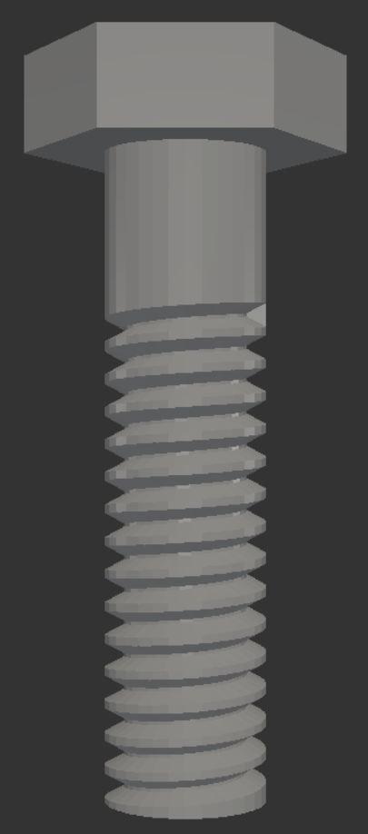

# Luametry: Programmable CAD for Developers

I've been working on a new tool called **Luametry**, and I wanted to share it with the daily.dev community. It is a high-performance programmatic CAD tool that binds a Lua dialect directly to the Manifold geometry kernel.

## The Journey

My programmatic CAD journey started with writing a Lua library that wrapped OpenSCAD. I wanted to use general programming language features such as proper string manipulation, first-class functions, and package management, that were missing from OpenSCAD's native language.

I eventually decided to cut out the middleman and run without OpenSCAD entirely. I chose **Manifold** as the underlying geometry kernel, an engineering decision driven by its speed and robustness. This choice was validated when I learned that OpenSCAD is also adopting Manifold as its new alternative backend. Now, instead of generating code, Luametry binds Lua directly to the Manifold kernel.

## Why Direct Binding?

Bypassing the intermediate layer allowed for significant improvements:

*   **Performance**: Direct calls to the C++ kernel are much faster than generating and parsing script files.
*   **API Design**: I was able to design an API specifically tailored for procedural modeling, rather than adhering to existing conventions.
*   **Language Power**: While I did end up creating a slightly customized dialect of Lua ("Luam") to enforce cleaner semantics, the core experience is still that of a full-featured programming language.

## Code Example

Here is an example of creating a threaded hex bolt. This demonstrates the procedural API and the explicit argument aliases.



```lua
const cad = require("cad")
const shapes = require("shapes")

-- 1. Create Head
head = cad.create.cylinder({
    radius=5, height=3, segments=6, center=true
})
-- Align head (move UP)
head = cad.modify.translate(head, {0, 0, 1.5})

-- 2. Create Shaft
shaft = cad.create.cylinder({
    radius=2.5, height=20, segments=32, center=true
})
-- Align shaft (move DOWN)
shaft = cad.modify.translate(shaft, {0, 0, -10})

-- 3. Create Thread (Cutter)
-- 'cut=true' generates a negative shape for subtraction
thread_cutter = shapes.thread({
    radius=2.5, height=15, pitch=1.0, segments=32, cut=true
})
thread_cutter = cad.modify.translate(thread_cutter, {0, 0, -20})

-- 4. Apply Threading (Boolean Difference)
threaded_shaft = cad.combine.difference({shaft, thread_cutter})

-- 5. Final Assembly
bolt = cad.combine.union({head, threaded_shaft})

cad.export(bolt, "bolt.stl")
```

## Key Features

*   **Fast Geometry**: Heavy operations are delegated to the C++ Manifold kernel.
*   **Live Reloading**: The CLI supports a live mode that updates the viewer instantly upon file save.
*   **Standard Library**: meaningful primitives and helper functions are built-in.

## Try It Out

I am looking for feedback on the ease of use and the API design.

https://github.com/BenSiv/luametry
